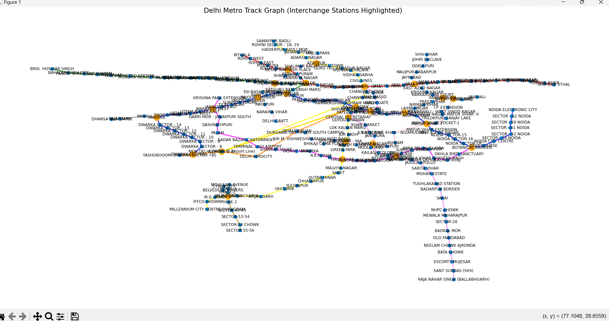
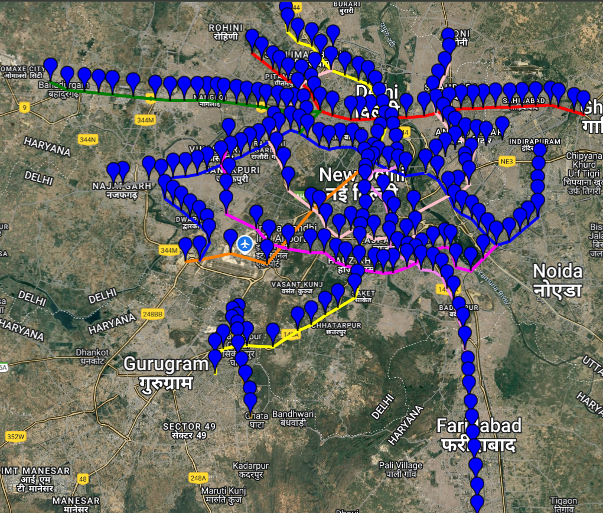

# Metro Shortest Path Finder

## Overview
The Metro Shortest Path Finder is a Python application that integrates various functionalities to help users find the shortest path between metro stations using Dijkstra's algorithm. The application provides a user-friendly interface for selecting stations and visualizes the metro network graphically.



## Project Structure
The project consists of the following files:

- **app.py**: The main application file that integrates functionalities and provides a user interface for station selection and displaying the shortest path.
- **djkastra.cpp**: Implements Dijkstra's algorithm to find the shortest path between two stations in the metro network. It processes data from CSV files and outputs the shortest path, distance, time, and fare.
- **graph.py**: Utilizes the NetworkX library to create and visualize the metro network graph, highlighting interchange stations.
- **gmap.py**: Uses the gmplot library to create a Google Map visualization of the metro stations and edges, marking interchange stations and using different colors for different metro lines.
- **stations.csv**: Contains the names and geographical coordinates (latitude and longitude) of the metro stations.
- **edges.csv**: Defines the connections between stations, including source and target stations, as well as the line name for each connection.
- **lines.csv**: Contains the names of the metro lines and their corresponding color codes for visualization purposes.

## Setup Instructions
1. Ensure you have Python installed on your system.
2. Install the required libraries:
   ```
   pip install pandas networkx matplotlib gmplot
   ```
3. Place the CSV files (`stations.csv`, `edges.csv`, `lines.csv`) in the project directory.

## Usage
1. Run the application:
   ```
   python app.py
   ```
2. Select the source and destination stations from the dropdown menus.
3. The application will display the shortest path, distance, estimated time, and fare.
4. The metro network graph and Google Map will update to show the selected route.

## Features
- User-friendly interface for selecting metro stations.
- Visualization of the metro network graph with highlighted interchange stations.
- Google Map representation of the metro stations and their connections.
- Calculation of the shortest path using Dijkstra's algorithm, including distance, time, and fare estimation.

## Acknowledgments
This project utilizes the following libraries:
- [Pandas](https://pandas.pydata.org/)
- [NetworkX](https://networkx.org/)
- [Matplotlib](https://matplotlib.org/)
- [gmplot](https://github.com/google/gmplot)
